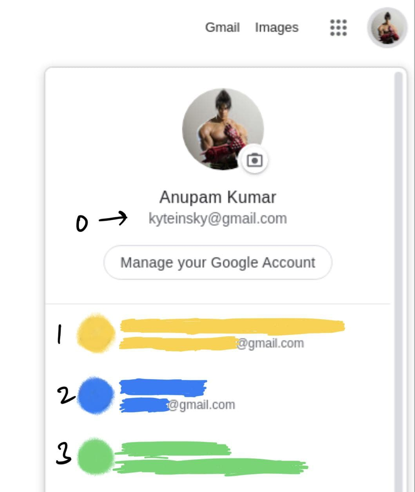

# Meet Lookup Chrome Extension for GMeet

<p align="right">
  
</p>

### This extension automates joining, muting microphone, blocking video, and monitoring for keywords if:
<br />

> - someone calls out your **name**
> - teacher mentions some surprise **test**
> - or any secret keyword to warn you put in chat by your friend :wink:

#### Keywords are picked up from chat window and captions, and then checked against the list of words provided by you.

---
**Note:** This implies that if someone **talks** or **types** about for eg. test, then you are instantly notified about it.

** Works for only them whose organizations have bought the GSuite

---


## How to use it

#### Load the extension
1. Clone this repo or download zip and extract it
2. Go to [chrome://extensions](chrome://extensions) and turn the Developer mode ON
3. Click on "Load Unpacked" and select the cloned or extracted folder named meet_lookup

<br />

#### Use it

1. You set the meet link, start time, and duration of the meet
2. Set authuser and keywords once
3. ```python
	if everything_correct:
		press_okay_button()
	else:
		rectify_it()
		press_okay_button()

#### That's it! Now sit back and relax.

### What's authuser?
authuser is the index number of the google account from among the signed in accounts on that particular browser, i.e. chrome

Simpler explanation: Go to [Google](https://google.com) and then you can find your authuser for your account like this:



---

<br />

## How it works (Good to know)

Application flow is as follows:

- Timers are set for your meets and also for ending the meet
- If its time, extension fires up a new tab for that meeting/class
- And the tab is muted instantly (speaker muted)
- Now the mic is muted if not already, same with video, and then meet is joined
- After two seconds app starts to look for the captions button and chat box button, and opens them
- Then the most important step: start comparing words with the provided list
- If match is found
  - Alert the user using alert function of browser and show a notification
  - Unmute the meet tab (unmute speakers)
  - And disable all observers for words comparison
  - **Essentially the app stops working for that meet and you are in control for the rest of the duration of the meet**

> If your internet connection is too slow like a page is not loaded in 20 seconds tops, I don't think it would be nice to join the meet and yeah the extension won't work as expected or told.

---

### TODOS:
1. failsafe for wrong authuser doesn't work quite well, so double check your authuser value before dozing off :slightly_smiling_face:
2. compatibility with non-gsuite users
3. function to turn on mic or video upon joining the meet (may turn out to be disastrous, but can be useful for some folks)
4. A nice little logo

<br />
<br />

### Thanks!
